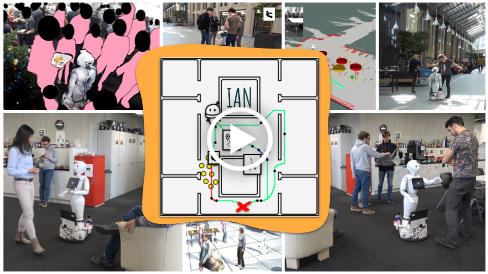

# IAN

News: the video of the IROS presentation is now available
[](https://www.youtube.com/watch?v=qbzbXufX6V4)

Paper: [pdf](http://ras.papercept.net/images/temp/IROS/files/1703.pdf)
## Install

<details>
<summary>Installing IAN for ROS noetic / python 3</summary>

install [ROS](http://wiki.ros.org/melodic/Installation/Ubuntu)

```bash
set -e
# Makes sure basic dependencies are installed
sudo echo "I shouldn't copy-paste code I don't understand!"
sudo apt -y install git
sudo apt -y install python3-catkin-tools python3-wstool
sudo apt -y install python3-pip virtualenv
sudo apt -y install libssh2-1-dev
```

```bash
# Makes sure ROS is sourced
[ ! -z $ROS_DISTRO ] || source /opt/ros/noetic/setup.bash || source /opt/ros/melodic/setup.bash || source /opt/ros/kinetic/setup.bash
[ ! -z $ROS_DISTRO ] || { echo -e '\033[0;31mError: ROS is not sourced.\033[0m' &&
                          echo "to install ROS, visit: http://wiki.ros.org/melodic/Installation/Ubuntu" &&
                          sleep 3 && exit 1 ; }
# Install to a new ros workspace:
mkdir -p ~/IAN/ian_ws/src
cd ~/IAN/ian_ws
catkin config --merge-devel
catkin config --extend /opt/ros/$ROS_DISTRO
catkin config -DCMAKE_BUILD_TYPE=Release -DPYTHON_EXECUTABLE=/usr/bin/python3
cd src
git clone https://github.com/ethz-asl/interaction_actions_for_navigation.git --branch noetic
```

```bash
# apt-get Dependencies
# (Ensure dependencies listed in dependencies.rosinstall get cloned correctly)
sudo apt -y install autoconf build-essential libtool
#sudo apt -y install ros-$ROS_DISTRO-pepper-* ros-$ROS_DISTRO-naoqi-driver
sudo apt -y install ros-$ROS_DISTRO-joy
sudo apt -y install ros-$ROS_DISTRO-costmap-converter
sudo apt -y install ros-$ROS_DISTRO-move-base ros-$ROS_DISTRO-teb-local-planner
sudo apt -y install ros-$ROS_DISTRO-map-server
cd ~/IAN/ian_ws/src
wstool init
wstool merge interaction_actions_for_navigation/dependencies.rosinstall
wstool update
```

```bash
# Create and source a virtualenv
cd ~/IAN
virtualenv ianvenv --python=python3.6
source ~/IAN/ianvenv/bin/activate
pip install numpy matplotlib Cython rospkg pyyaml gym opencv-python
# (latest numba has build error on python 2)
pip install numba==0.44 llvmlite==0.30
```

```bash
# Python dependencies
source ~/IAN/ianvenv/bin/activate
pip install --extra-index-url https://rospypi.github.io/simple/ rospy rosbag tf tf2_ros nav_msgs std_srvs visualization_msgs
pip install pyIAN asl-pepper-2d-sim asl-pepper-responsive pyrangelibc-danieldugas pyrvo2-danieldugas pymap2d pylidar2d pyniel ros-frame-msgs
```

```bash
# Pedsim and subdependencies
cd ~/IAN/ian_ws/src
git clone https://github.com/srl-freiburg/pedsim_ros.git
cd pedsim_ros
git submodule update --init --recursive
cd ~/IAN/ian_ws/src
```

```bash
# Build
cd ~/IAN/ian_ws
catkin build pedsim_visualizer pedsim_simulator spencer_tracking_rviz_plugin
catkin build gmapping map_matcher
catkin build pylidar2d_ros responsive
catkin build asl_pepper_gmapping asl_pepper_2d_simulator asl_pepper_sensor_preprocessing asl_pepper_motion_planning
catkin build frame_msgs
catkin build ia_ros
```
</details>

<details>
<summary>Installing IAN for ROS melodic/kinetic / python 2</summary>

install [ROS](http://wiki.ros.org/melodic/Installation/Ubuntu)

```bash
set -e
# Makes sure basic dependencies are installed
sudo echo "I shouldn't copy-paste code I don't understand!"
sudo apt -y install git
sudo apt -y install python-catkin-tools python-wstool
sudo apt -y install python-pip virtualenv
sudo apt -y install libssh2-1-dev
```

```bash
# Makes sure ROS is sourced
[ ! -z $ROS_DISTRO ] || source /opt/ros/melodic/setup.bash || source /opt/ros/kinetic/setup.bash
[ ! -z $ROS_DISTRO ] || { echo -e '\033[0;31mError: ROS is not sourced.\033[0m' &&
                          echo "to install ROS, visit: http://wiki.ros.org/melodic/Installation/Ubuntu" &&
                          sleep 3 && exit 1 ; }
# Install to a new ros workspace:
mkdir -p ~/IAN/ian_ws/src
cd ~/IAN/ian_ws
catkin config --merge-devel
catkin config --extend /opt/ros/$ROS_DISTRO
catkin config -DCMAKE_BUILD_TYPE=Release
cd src
git clone https://github.com/ethz-asl/interaction_actions_for_navigation.git --branch python2
git clone https://github.com/danieldugas/asl_pepper_public.git
```

```bash
# apt-get Dependencies
# (Ensure dependencies listed in dependencies.rosinstall get cloned correctly)
sudo apt -y install autoconf build-essential libtool
sudo apt -y install ros-$ROS_DISTRO-pepper-* ros-$ROS_DISTRO-naoqi-driver
sudo apt -y install ros-$ROS_DISTRO-joy
sudo apt -y install ros-$ROS_DISTRO-costmap-converter
sudo apt -y install ros-$ROS_DISTRO-move-base ros-$ROS_DISTRO-teb-local-planner
sudo apt -y install ros-$ROS_DISTRO-map-server
cd ~/IAN/ian_ws/src
wstool init
wstool merge interaction_actions_for_navigation/dependencies.rosinstall
wstool update
```

```bash
# Create and source a virtualenv
cd ~/IAN
virtualenv ianvenv --system-site-packages --python=python2.7
source ~/IAN/ianvenv/bin/activate
pip install numpy matplotlib Cython rospkg pyyaml gym
# (latest numba has build error on python 2)
pip install numba==0.44 llvmlite==0.30
```

```bash
# Python dependencies
source ~/IAN/ianvenv/bin/activate
cd ~/IAN/ian_ws/src/interaction_actions_for_navigation/external/asl_pepper/asl_pepper_2d_simulator/python
pip install -e .
cd ~/IAN/ian_ws/src
{ python -c "import pyniel" && cd ~/Documents/pyniel && echo "Existing pyniel found." ; } || \
{ git clone https://github.com/danieldugas/pyniel.git && echo "Cloning pyniel." && cd pyniel ; }
pip install -e .
cd ~/IAN/ian_ws/src
git clone https://github.com/danieldugas/range_libc.git --branch comparisons
cd range_libc/pywrapper
python setup.py install
cd ~/IAN/ian_ws/src
git clone https://github.com/danieldugas/pymap2d.git
cd pymap2d
pip install .
cd ~/IAN/ian_ws/src
git clone https://github.com/danieldugas/pylidar2d.git
cd pylidar2d
pip install .
cd ~/IAN/ian_ws/src/interaction_actions_for_navigation/python/cIA
pip install .
cd ..
pip install -e .
cd ~/IAN/ian_ws/src
cd responsive/lib_dwa
pip install .
cd ../lib_clustering
pip install .
# External python dependencies
cd ~/IAN/ian_ws/src
git clone https://github.com/danieldugas/Python-RVO2.git
cd Python-RVO2
pip install .
```

```bash
# Pedsim and subdependencies
cd ~/IAN/ian_ws/src
git clone https://github.com/srl-freiburg/pedsim_ros.git
cd pedsim_ros
git submodule update --init --recursive
cd ~/IAN/ian_ws/src
```

```bash
# Build
cd ~/IAN/ian_ws
catkin build pedsim_visualizer pedsim_simulator spencer_tracking_rviz_plugin
catkin build gmapping map_matcher
catkin build pylidar2d_ros responsive
catkin build asl_pepper_gmapping asl_pepper_2d_simulator asl_pepper_sensor_preprocessing asl_pepper_motion_planning
catkin build frame_msgs
catkin build ia_ros
```

</details>


## Run IAN in a Simulation

```bash
source ~/IAN/ianvenv/bin/activate
source ~/IAN/ian_ws/devel/setup.bash
rviz -d ~/IAN/ian_ws/src/interaction_actions_for_navigation/external/asl_pepper/rviz/ia_sim.rviz &> /tmp/rviz-log &
roslaunch ia_ros auto_ros_ia_node.launch
```

This will launch a self-running example, where a goal is automatically provided.

## Run IAN on a Real Robot

here's an example launch file for running IAN on our robot:

```xml
<?xml version="1.0"?>
<launch>
  <arg name="mapname" default="rik_bananas" />
  <arg name="mapfolder" default="$(env HOME)/maps"/>
  <arg name="script_args" default=""/>
  <arg name="ia_downsampling_passes" default="3"/>

  <arg name="localization" default="true"/>


  <!-- Gmapping & Map Matching -->
  <include file="$(find asl_pepper_gmapping)/launch/gmapping.launch" if="$(arg localization)">
    <arg name="output" value="log"/>
  </include>
  <include file="$(find map_matcher)/launch/map_matcher.launch" if="$(arg localization)">
    <arg name="output" value="log" />
    <arg name="slam_map_topic" value="/gmap"/>
    <arg name="reference_map_name" value="$(arg mapname)"/>
    <arg name="maps_folder" value="$(arg mapfolder)"/>
    <arg name="launch_prefix" value="nice -n 20" />
  </include>
  <!-- Otherwise just publish reference map -->
  <node pkg="map_server" type="map_server" name="ref_map_server"
    args="$(arg mapfolder)/$(arg mapname).yaml" if="$(eval arg('localization') != true)">
    <param name="frame_id" value="reference_map" />
    <remap from="/map" to="/reference_map"/>
  </node>

  <!-- ia planner -->
  <node pkg="ia_ros" type="ros_ia_node" name="ia_planner" output="screen"
    args="$(arg script_args)" launch-prefix="" >
    <remap from="/tracked_persons" to="/rwth_tracker/tracked_persons" />
    <param name="reference_map_name" value="$(arg mapname)"/>
    <param name="reference_map_downsampling_passes" value="$(arg ia_downsampling_passes)"/>
  </node>

  <!-- Skill Planners -->
  <!-- _________________________________________________________________________________ -->

  <!-- Responsive -->
  <node pkg="responsive" type="responsive" name="responsive" output="screen"
    args="--forward-only">
    <remap from="/stop_autonomous_motion" to="/responsive/stop_autonomous_motion" />
    <remap from="/resume_autonomous_motion" to="/responsive/resume_autonomous_motion" />
    <remap from="/global_planner/current_waypoint" to="/responsive/waypoint" />
  </node>

  <!-- RVO Planner -->
  <node pkg="asl_pepper_motion_planning" type="rvo_planner" name="rvo_planner" output="screen"
    args="">
    <!-- with localization disabled, we use the current SLAM map to plan in -->
    <param name="reference_map_name" value="/gmap" if="$(eval arg('localization') != true)"/>
    <param name="reference_map_folder" value="rostopic" if="$(eval arg('localization') != true)"/>
    <param name="reference_map_frame" value="gmap" if="$(eval arg('localization') != true)"/>
    <!-- with localization enabled, we use the refence map (loaded from on disk) to plan in -->
    <param name="reference_map_name" value="$(arg mapname)" if="$(arg localization)" />
    <param name="reference_map_folder" value="$(arg mapfolder)" if="$(arg localization)" />
    <param name="reference_map_frame" value="reference_map" if="$(arg localization)" />
    <param name="fixed_frame" value="odom"/>
    <param name="reference_map_downsampling_passes" value="1" />
    <param name="static_obstacles_max_distance" value="2" />
    <remap from="/stop_autonomous_motion" to="/rvo_planner/stop_autonomous_motion" />
    <remap from="/resume_autonomous_motion" to="/rvo_planner/resume_autonomous_motion" />
    <remap from="/global_planner/current_waypoint" to="/rvo_planner/waypoint" />
  </node>

  <node type="rviz" name="rviz" pkg="rviz" args="-d $(env HOME)/.rviz/ia.rviz" output="log"/>
</launch>
```


